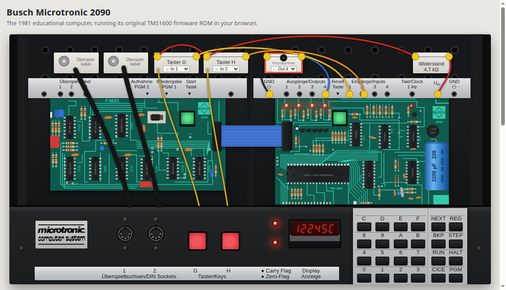

# Busch Microtronic 2090 — browser emulator

**Run it: <https://lambdamikel.github.io/microtronic-emulator/>**

A JavaScript-only emulator of the 1981 Busch Microtronic 2090 that runs the
**original TMS1600 firmware ROM**. Static files, no build step, no server code:
open `index.html`, or serve the folder from GitHub Pages.

Sister project: the [Kosmos CP1 emulator](https://github.com/lambdamikel/kosmos-cp1-emulator).

## What is emulated

The emulation is at pin level; nothing in the firmware is patched or intercepted.

- **TMS1600 CPU** (`js/tms1600.js`): all opcodes, the 6-bit LFSR program counter,
  chapter/page buffers, the 3-level call stack, 8×16 nibbles of RAM, the output PLA.
  Semantics follow Jason T. Jacques' TMS1000-family emulator.
- **2114 program RAM**, wired as in the Busch schematic: A0–A3 from O0–O3, A4–A7
  from R0–R3, A8/A9 from R4/R5 (selecting the three nibbles of an instruction),
  data read through the L inputs (R11 = KL), written from R7–R10 through the
  inverting 4502 buffer under the R13 strobe.
- **Display**: six multiplexed 7-segment digits (R0–R5 strobes, R12 enable,
  segments from the O outputs). Segment brightness is integrated over time, so
  flicker and ghosting while a program runs look as they do on the machine.
- **Keypad** matrix, **DOT** output LEDs (R7–R10), **DIN** inputs (gated by R6),
  **carry/zero** LEDs (R14/R15), the **reset** button, and the **1 Hz clock**,
  which can be patched to input 4 for the built-in clock (PGM 3 / PGM 4).

At the original clock (500 kHz, 83,333 instruction cycles/s) the interpreter
executes roughly 58 Microtronic instructions per second.

- **Tone circuit of manual Part 2** (p. 52-53): the astable multivibrator wired to outputs 1-4 through
  22k / 10k / 4.7k / 2.2k resistors, so the output value sets the pitch. The pitch curve is fitted to the
  manual's own melodies (4 = c, 6 = d, 8 = e, A = f, C = g); values 1-3 give no tone, as the manual says.
  With it come the manual's mini organ, composing computer, music box and the Moon Landing with sound effects.
- A **Sound off** button silences whatever is sounding until the next tone.
- **PicoRAM 2090 sound**: the extended op-code `50D` (play note), with arguments
  given as `0xx` literals or `3Fx` register reads, detected on instruction fetch
  as the PicoRAM does. Register arguments are read directly instead of through
  PicoRAM's interrogation program, so they cost no extra time here.

Not emulated: the 2095 cassette interface (its board is drawn, but does nothing). PGM 1 / PGM 2 hang, as they do on a
2090 without the interface; press Reset.

## Using it

- Inputs: click an input jack to plug in a high level; click the 1 Hz jack to run
  a cable to input 4. The red G/H keys are wired to an input via their Taster block.
- The piezo buzzer block is wired to an output of your choice (default: output 4) and
  sounds while that output is on. A patch cable can connect the 1 Hz clock to an input,
  and another an output to an input. Programs that need particular wiring (Monarch:
  buzzer on output 1, keys G/H on inputs 1/2; Mensch: output 4 to input 4; the manuals'
  games: buzzer on output 1; Racing and Morse: clock on input 4) are wired automatically
  when loaded from the library, and cables a program does not need are taken off.
- Click the keys, or drive everything from the PC keyboard: `0`–`9` `A`–`F`, `H` HALT, `N`/`Enter`/`Space` NEXT, `R` RUN,
  `S`/`T` STEP, `K` BKP, `G` REG, `P` PGM, `X`/`Backspace` C/CE, `Esc` Reset, `,` key G, `.` key H.
- **[Programmer's guide](https://lambdamikel.github.io/microtronic-emulator/guide.html)** ([PDF](Microtronic_Guide.pdf)): an
  independent English guide to operating and programming the Microtronic, with every instruction,
  the flags, inputs and outputs and worked examples, all tried on the firmware. Its ten example
  programs are in the library.
- Pick a program from the library and press **Load & run**, or open your own
  `.MIC` file. Loading writes program memory directly and then types
  `HALT NEXT 0 0 RUN` on the keypad.
- The **Inside** panel shows the program counter, flags, both register banks, the inputs and
  outputs, the address RET (F07) returns to,
  and a live disassembly of program memory; click a line to edit it.
- Links: `index.html?load=HANOI&speed=4` (`run=0` loads without starting).

Program memory is kept in the browser's local storage between visits.

## Files

    index.html            page
    css/microtronic.css   console look
    js/tms1600.js         CPU + board model (no DOM; usable on its own)
    js/ui.js              GUI
    js/rom.js             the 4096-byte firmware ROM, base64
    js/programs.js        program library (generated by tools-build-programs.py)
    programs/rathje/      Björn Rathje's games (.MIC), as published by him
    tools-build-board.py  draws the two circuit boards (SVG) into index.html
    test/                 headless-Chrome checks of the core against the ROM

## Acknowledgements

- **Firmware ROM extraction** — the TMS1600 mask ROM was dumped and disassembled
  by Decle, Jason T. Jacques and Michael Wessel:
  [Microtronic Firmware ROM Archaeology](https://hackaday.io/project/197415-microtronic-firmware-rom-archaeology) (Hackaday.io).
- **Microtronic Phoenix** — the hardware emulator that first ran this ROM, with
  Jason T. Jacques' TMS1xxx emulator, whose CPU semantics and output-PLA table
  this emulator follows: <https://github.com/lambdamikel/microtronic-phoenix>,
  the [Phoenix project page on Hackaday.io](https://hackaday.io/project/202835-microtronic-phoenix),
  and [Jason's write-up](https://jsonj.co.uk/project/microtronic/).
- **Busch GmbH and Jörg Vallen** — the firmware ROM is © Busch; it was published
  with the kind permission of Jörg Vallen, co-designer of the Microtronic and author of its manuals.
- **Manuals** — the Microtronic manuals in English translation:
  [read online](https://lambdamikel.github.io/microtronic-2090-manuals-english/),
  [repository](https://github.com/lambdamikel/microtronic-2090-manuals-english).
- **Games by Björn Rathje** — Monarch2090 (the 1972 *Rotomat Monarch* slot machine),
  Kniffel2090 (Yahtzee) and Mensch2090 (Ludo) are © Björn Rathje. They are included
  unchanged, with his permission, in `programs/rathje/`; rules and playing instructions are
  in his repositories: [Monarch2090](https://github.com/rab-berlin/Monarch2090),
  [Kniffel2090](https://github.com/rab-berlin/Kniffel2090),
  [Mensch2090](https://github.com/rab-berlin/Mensch2090)
  ([github.com/rab-berlin](https://github.com/rab-berlin)).
- Programs, original manuals and schematic: [Busch-2090](https://github.com/lambdamikel/Busch-2090).
  Sound op-code: [PicoRAM 2090](https://github.com/lambdamikel/picoram2090).
  Annotated firmware: [microtronic-firmware-annotated](https://github.com/lambdamikel/microtronic-firmware-annotated).

## Made with Claude

The emulator core, the board model, the GUI and the board drawings were written
by Claude Opus 5.5 (Claude Code), working with Michael Wessel, who supplied the
photos, the hardware knowledge and the review.

## License

The emulator (code, drawings, documentation) is licensed under the
[GNU General Public License v3](LICENSE).

**Not covered by the GPL:** the Microtronic firmware ROM in `js/rom.js` is
© Busch GmbH and is included with the permission of Jörg Vallen. The games in
`programs/rathje/` are © Björn Rathje. The other bundled
Microtronic programs in `js/programs.js` come from the Busch manuals and the
projects named above and remain the property of their authors.
